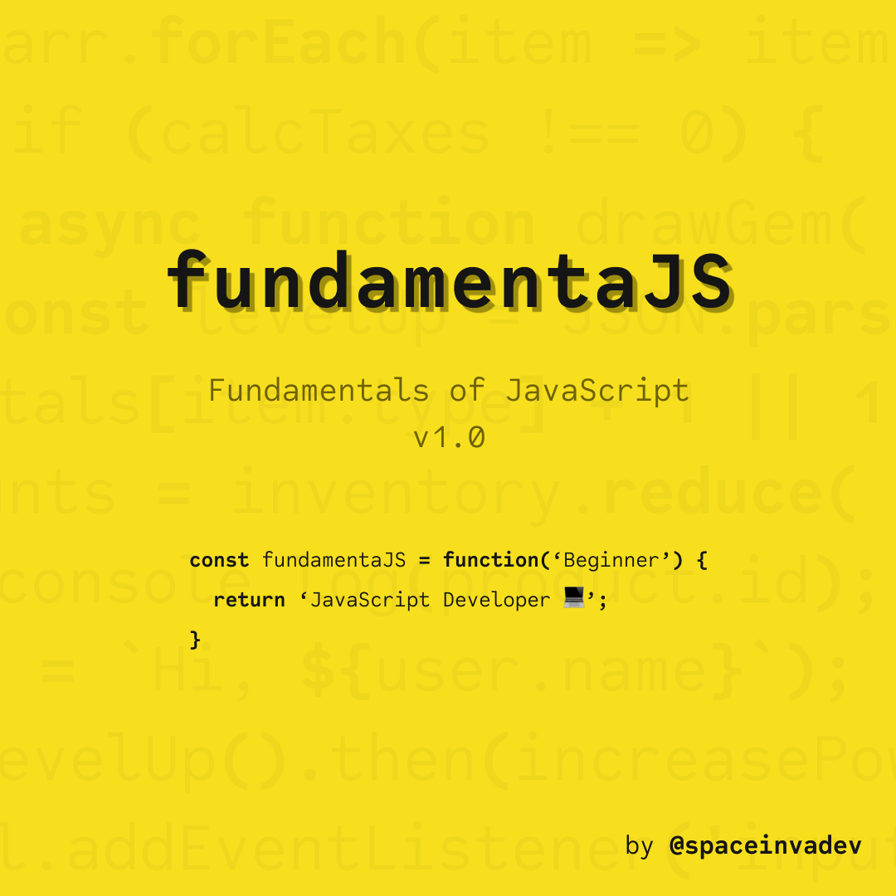

# fundamentaJS: Fundamentals of JavaScript

Welcome to fundamentaJS, an introductory course to JavaScript. This project started while I was learning the JavaScript language. I decided to document my learning process and share it publicly as an entry point to the JavaScript world for all those people out there who would like to learn the language. Many sources are referenced to complement the information.

Any feedback and suggestions are welcome. Feel free to submit yours via [_Pull Request_](https://help.github.com/en/github/collaborating-with-issues-and-pull-requests/about-pull-requests).

## Contents

### 1. [An Introduction to JavaScript](/introduction/intro.md)

#### 1.1 What is JavaScript?

#### 1.2 Manuals and specifications

#### 1.3 Code Editors

#### 1.4 Browser Developer Tools

### 2. JavaScript: The Basics

### 10. Additional Resources