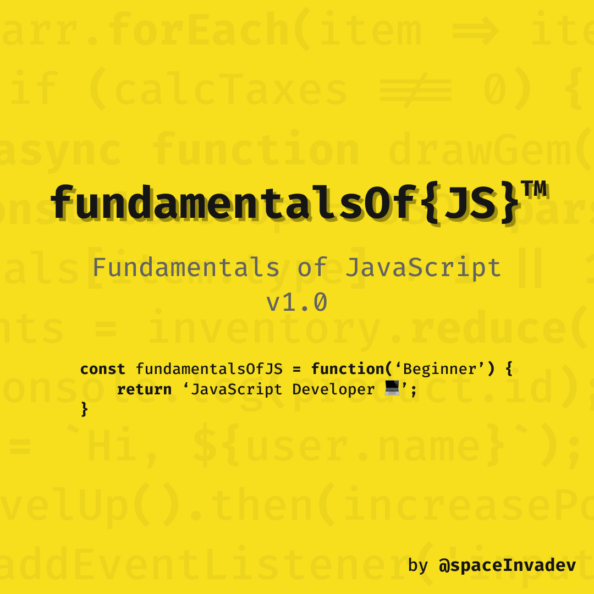

# fundamentalsOf{JS}™️

This is an introductory course to the JavaScript language. This project reflects my journey to becoming a JavaScript developer. Many sources are referenced to complement the information. I have decided to share this with everyone as an entry point to the world of JavaScript for all those people out there who would like to join us.

Any feedback and sugggestions are welcome. Feel free to submit yours via Pull Request.

## Contents

### 1. JavaScript 101

#### 1.1 What is JavaScript?

#### 1.2 Manuals and specifications

#### 1.3 Code Editors

#### 1.4 Browser Developer Tools

### 2. JavaScript: The Basics

### 10. Additional Resources